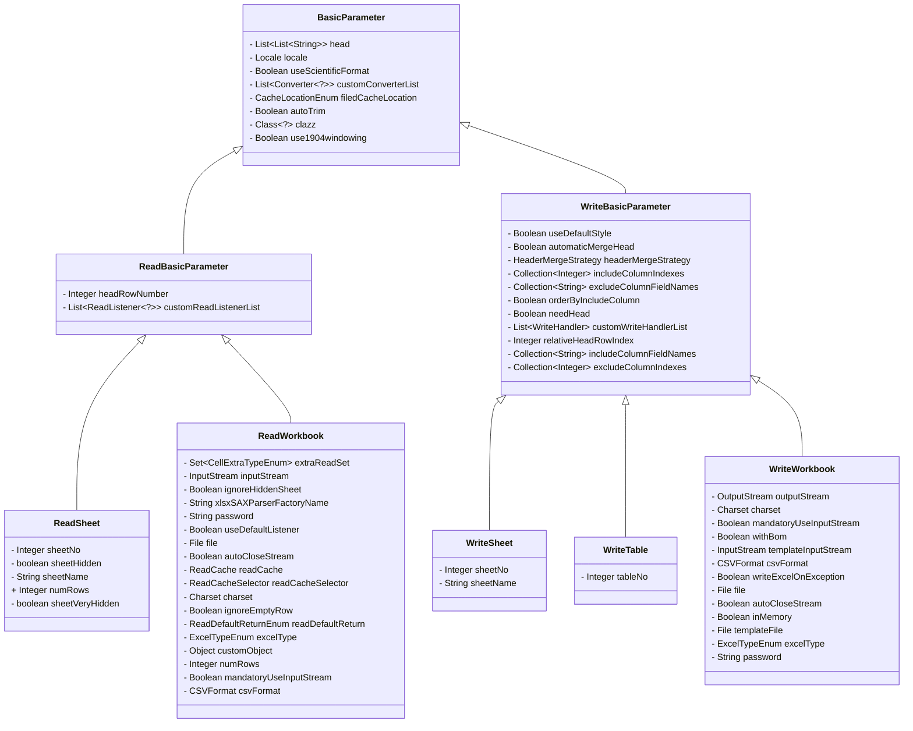

# Parameter

This section introduces the parameters used in the project.

## Class Diagram



## General Parameters

All parameters inherit from `BasicParameter`.

| Name                | Default Value | Description                                                                                                                                                                                                                                                                                                                                                                                                                                                                                                                                                                                                                                                                                                                              |
|---------------------|---------------|------------------------------------------------------------------------------------------------------------------------------------------------------------------------------------------------------------------------------------------------------------------------------------------------------------------------------------------------------------------------------------------------------------------------------------------------------------------------------------------------------------------------------------------------------------------------------------------------------------------------------------------------------------------------------------------------------------------------------------------|
| head                | Empty         | Choose one of `head` or `clazz`. Reads the list corresponding to the file header and matches the data based on the list. It is recommended to use class.                                                                                                                                                                                                                                                                                                                                                                                                                                                                                                                                                                                 |
| clazz               | Empty         | Choose one of `head` or `clazz`. Reads the class corresponding to the file header, and annotations can also be used. If neither is specified, all data will be read.                                                                                                                                                                                                                                                                                                                                                                                                                                                                                                                                                                     |
| customConverterList | Empty         | Many converters are loaded by default. You can add unsupported fields here.                                                                                                                                                                                                                                                                                                                                                                                                                                                                                                                                                                                                                                                              |
| autoTrim            | true          | Automatically trims the header, reads data, etc.                                                                                                                                                                                                                                                                                                                                                                                                                                                                                                                                                                                                                                                                                         |
| use1904windowing    | false         | Time is stored as a double-precision floating-point number starting from 1900, but sometimes the default start date is 1904. So setting this value changes the default start date to 1904.                                                                                                                                                                                                                                                                                                                                                                                                                                                                                                                                               |
| useScientificFormat | false         | When converting numbers to text, whether to use scientific notation for large values.                                                                                                                                                                                                                                                                                                                                                                                                                                                                                                                                                                                                                                                    |
| locale              | Empty         | DeepL Translate_ The world's most accurate translator                                                                                                                                                                                                                                                                                                                                                                                                                                                                                                                                                                                                                                                                                    |
| filedCacheLocation  | THREAD_LOCAL  | Parsing the fields of the class will have a cache. Before, it was placed globally in a Map. After 3.3.0, it is placed in ThreadLocal by default, meaning that each read and write will reparse the class. You can reflectively modify the annotations of the class, and concurrent scenarios will not affect each other.<br/>THREAD_LOCAL: Default, the cache will be cleared each time, but not the same time.<br/>MEMORY: Placed in global memory, theoretically better performance, but cannot modify the exported object through reflection, exclusion, etc.<br/>NONE: No caching, performance will degrade, consider using it when reading and writing at the same time, and you need to reflectively exclude, modify objects, etc. |

## Reading Operations

### ReadBasicParameter

| Name                   | Default Value | Description                                                                                                    |
|------------------------|---------------|----------------------------------------------------------------------------------------------------------------|
| customReadListenerList | Empty         | Can register multiple listeners. When reading spreadsheet, the listener's methods will be continuously called. |
| headRowNumber          | 1             | The number of rows in the header of spreadsheet, default is 1 row.                                             |

### ReadWorkbook

| Name                     | Default Value           | Description                                                                                                                                                                                                                                                                                                                                                                                                                                                         |
|--------------------------|-------------------------|---------------------------------------------------------------------------------------------------------------------------------------------------------------------------------------------------------------------------------------------------------------------------------------------------------------------------------------------------------------------------------------------------------------------------------------------------------------------|
| excelType                | Empty                   | The current type of spreadsheet, supports XLS, XLSX, CSV.                                                                                                                                                                                                                                                                                                                                                                                                           |
| inputStream              | Empty                   | Choose between `file` and `inputStream`. Reads the file stream. If a stream is received, it is used directly. If not, it is recommended to use the `file` parameter. Using `inputStream` will help create temporary files, but in the end it is still `file`.                                                                                                                                                                                                       |
| file                     | Empty                   | Choose between `inputStream` and `file`. Reads the file.                                                                                                                                                                                                                                                                                                                                                                                                            |
| mandatoryUseInputStream  | false                   | Forces the use of `inputStream` to create objects, which may degrade performance but will not create temporary files.                                                                                                                                                                                                                                                                                                                                               |
| charset                  | Charset#defaultCharset  | Only useful for CSV files, specifies the encoding used when reading the file.                                                                                                                                                                                                                                                                                                                                                                                       |
| autoCloseStream          | true                    | Automatically closes the read stream.                                                                                                                                                                                                                                                                                                                                                                                                                               |
| readCache                | Empty                   | For files smaller than 5MB, use memory. For files larger than 5MB, use `EhCache`. It is not recommended to use this parameter.                                                                                                                                                                                                                                                                                                                                      |
| readCacheSelector        | SimpleReadCacheSelector | Used to select when to use memory to store temporary data and when to use disk to store temporary data.                                                                                                                                                                                                                                                                                                                                                             |
| ignoreEmptyRow           | true                    | Ignore empty rows.                                                                                                                                                                                                                                                                                                                                                                                                                                                  |
| password                 | Empty                   | Password for reading the file.                                                                                                                                                                                                                                                                                                                                                                                                                                      |
| xlsxSAXParserFactoryName | Empty                   | Specifies the name of the class used for sax reading, for example: `com.sun.org.apache.xerces.internal.jaxp.SAXParserFactoryImpl`.                                                                                                                                                                                                                                                                                                                                  |
| useDefaultListener       | true                    | By default, `ModelBuildEventListener` is added to help convert to the object passed in. Setting it to `false` will not assist in converting objects, and custom listeners will receive a `Map<Integer, CellData>` object. If you still want to receive `class` objects, call the `readListener` method and add custom `beforeListener`, `ModelBuildEventListener`, and custom `afterListener`.                                                                      |
| extraReadSet             | Empty                   | Set of additional content to be read, which is not read by default.                                                                                                                                                                                                                                                                                                                                                                                                 |
| readDefaultReturn        | STRING                  | STRING: Returns an array of `Map<Integer, String>`, the return value is the content you see in the cell without clicking on it.<br/>ACTUAL_DATA: Returns an array of `Map<Integer, Object>`, the actual data stored, will automatically convert types, `Object` type can be `BigDecimal`, `Boolean`, `String`, `LocalDateTime`, `null`, one of them.<br/>READ_CELL_DATA: Returns an array of `Map<Integer, ReadCellData<?>>`, where `?` type refers to ACTUAL_DATA. |
| customObject             | STRING                  | STRING: Returns an array of `Map<Integer, String>`, the return value is the content you see in the cell without clicking on it.<br/>ACTUAL_DATA: Returns an array of `Map<Integer, Object>`, the actual data stored, will automatically convert types, `Object` type can be `BigDecimal`, `Boolean`, `String`, `LocalDateTime`, `null`, one of them.<br/>READ_CELL_DATA: Returns an array of `Map<Integer, ReadCellData<?>>`, where `?` type refers to ACTUAL_DATA. |
| numRows                  | 0                       | Read the specified number of rows. 0 means no limit on the number of rows, i.e. read all rows.                                                                                                                                                                                                                                                                                                                                                                      |
| ignoreHiddenSheet        | true                    | `@since 1.3.0`<br/> Ignore hidden sheets.                                                                                                                                                                                                                                                                                                                                                                                                                           |
| csvFormat                | CSVFormat.DEFAULT       | `@since 1.3.0`<br/> Set the CSVFormat object, which is only valid for csv files.                                                                                                                                                                                                                                                                                                                                                                                    |

### ReadSheet

| Name            | Default Value | Description                                                                                    |
|-----------------|---------------|------------------------------------------------------------------------------------------------|
| sheetNo         | 0             | The code of the Sheet to be read, recommended to use this to specify which Sheet to read.      |
| sheetName       | Empty         | Match the Sheet by name.                                                                       |
| sheetHidden     | false         | Normal Hidden Status                                                                           |
| sheetVeryHidden | false         | Absolute Hidden State                                                                          |
| numRows         | 0             | Read the specified number of rows. 0 means no limit on the number of rows, i.e. read all rows. |

## Writing Operations

### WriteBasicParameter

| Name                    | Default Value | Description                                                                                                                                                                            |
|-------------------------|---------------|----------------------------------------------------------------------------------------------------------------------------------------------------------------------------------------|
| customWriteHandlerList  | Empty         | Writing handler. Can implement `WorkbookWriteHandler`, `SheetWriteHandler`, `RowWriteHandler`, `CellWriteHandler`, which will be called at different stages of writing to spreadsheet. |
| relativeHeadRowIndex    | 0             | Number of rows to leave blank above spreadsheet.                                                                                                                                       |
| needHead                | true          | Whether to write the header to spreadsheet.                                                                                                                                            |
| useDefaultStyle         | true          | Whether to use default styles.                                                                                                                                                         |
| automaticMergeHead      | true          | Automatically merge headers, matching the same fields above, below, left, and right in the header.                                                                                     |
| headerMergeStrategy     | null          | Header merge strategy. If null, the behavior is determined by `automaticMergeHead` for backward compatibility. Options: `NONE`, `HORIZONTAL_ONLY`, `VERTICAL_ONLY`, `FULL_RECTANGLE`, `AUTO`. See details below. |
| excludeColumnIndexes    | Empty         | Exclude indexes of data in the object.                                                                                                                                                 |
| excludeColumnFieldNames | Empty         | Exclude fields of data in the object.                                                                                                                                                  |
| includeColumnIndexes    | Empty         | Only export indexes of data in the object.                                                                                                                                             |
| includeColumnFieldNames | Empty         | Only export fields of data in the object.                                                                                                                                              |
| orderByIncludeColumn    | false         | When using the parameters `includeColumnFieldNames` or `includeColumnIndexes`, it will sort according to the order of the collection passed in.                                        |

#### Header Merge Strategy

The `headerMergeStrategy` parameter provides fine-grained control over how headers are merged:

- **NONE**: No automatic merging is performed.
- **HORIZONTAL_ONLY**: Only merges cells horizontally (same row).
- **VERTICAL_ONLY**: Only merges cells vertically (same column).
- **FULL_RECTANGLE**: Only merges complete rectangular regions where all cells have the same name.
- **AUTO**: Automatic merging (default behavior for backward compatibility).

**Example**:

```java
FesodSheet.write(fileName)
    .head(head)
    .headerMergeStrategy(HeaderMergeStrategy.FULL_RECTANGLE)
    .sheet()
    .doWrite(data());
```

**Note**: If `headerMergeStrategy` is not set, the behavior is determined by `automaticMergeHead`:

- `automaticMergeHead == true` → `HeaderMergeStrategy.AUTO`
- `automaticMergeHead == false` → `HeaderMergeStrategy.NONE`

### WriteWorkbook

| Name                    | Default Value          | Description                                                                                                                                   |
|-------------------------|------------------------|-----------------------------------------------------------------------------------------------------------------------------------------------|
| excelType               | Empty                  | The current type of spreadsheet, supports XLS, XLSX, CSV.                                                                                     |
| outputStream            | Empty                  | Choose between `file` and `outputStream`. Writes the file stream.                                                                             |
| file                    | Empty                  | Choose between `outputStream` and `file`. Writes the file.                                                                                    |
| templateInputStream     | Empty                  | Template file stream.                                                                                                                         |
| templateFile            | Empty                  | Template file.                                                                                                                                |
| charset                 | Charset#defaultCharset | Only useful for CSV files, specifies the encoding used when writing the file.                                                                 |
| autoCloseStream         | true                   | Automatically closes the write stream.                                                                                                        |
| password                | Empty                  | Password for reading the file.                                                                                                                |
| inMemory                | false                  | Whether to process in memory, by default, a temporary file will be generated to save memory. Memory mode is more efficient, but prone to OOM. |
| writeExcelOnException   | false                  | If an exception occurs during writing, whether to try to write the data to spreadsheet.                                                       |
| withBom                 | true                   | Set the encoding prefix in the CSV file, otherwise Office software may display garbled characters.                                            |
| mandatoryUseInputStream | false                  | Forces the use of `inputStream` to create objects, which may degrade performance but will not create temporary files.                         |
| csvFormat               | CSVFormat.DEFAULT      | `@since 1.3.0`<br/> Set the CSVFormat object, which is only valid for csv files.                                                              |

### WriteSheet

| Name      | Default Value | Description                                             |
|-----------|---------------|---------------------------------------------------------|
| sheetNo   | 0             | Code of the Sheet to be written.                        |
| sheetName | Empty         | Name of the Sheet to be written, defaults to `sheetNo`. |

### WriteTable

| Name    | Default Value | Description                      |
|---------|---------------|----------------------------------|
| tableNo | 0             | Code of the table to be written. |
